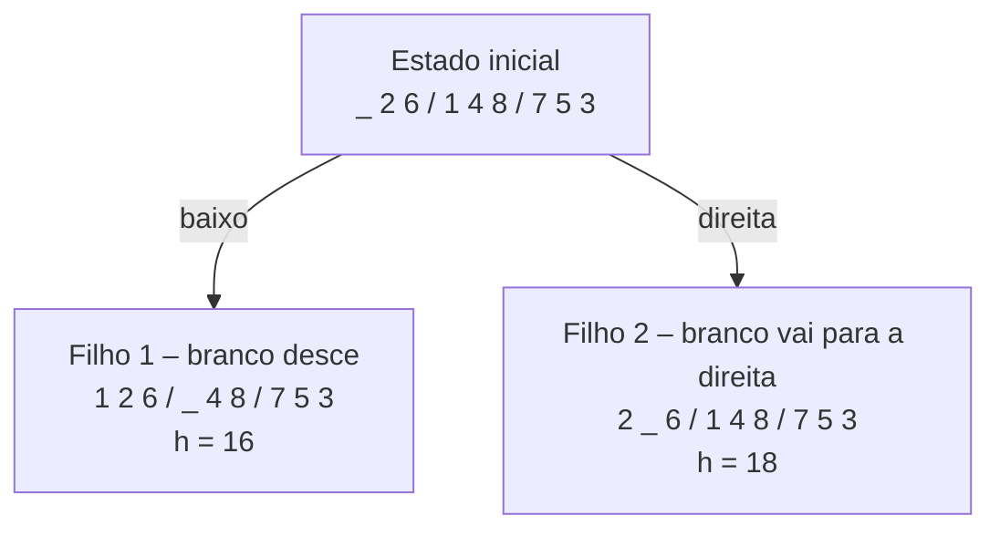
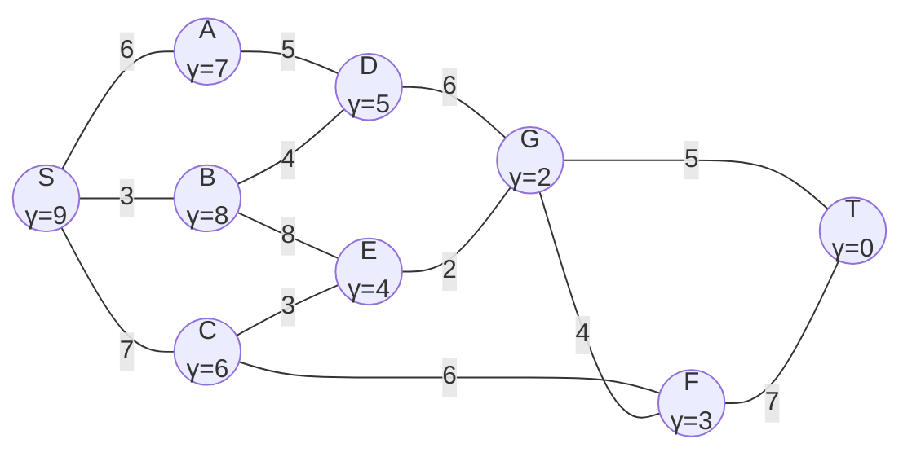
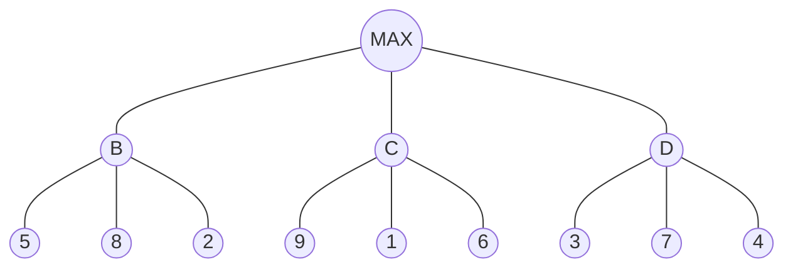
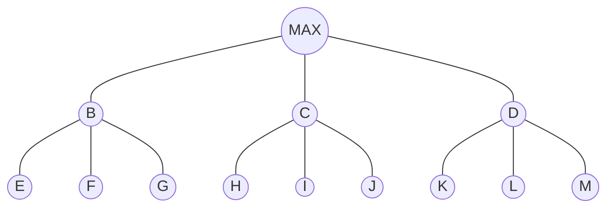

# ESPECIFICAÇÃO DE FORMULÁRIO – INTELIGÊNCIA ARTIFICIAL (1ª AVALIAÇÃO)

**Origem:** Lista de Exercícios – P1 – UFGD / Bacharelado em Sistemas de Informação / Prof. Alexandre Augusto Angelo de Souza.
**Destino:** este arquivo será lido por outra IA que construirá o formulário. Siga as instruções da seção "Instruções gerais para o desenvolvedor".

---

## 0. Instruções gerais para o desenvolvedor (leia antes de implementar)

1. **Estrutura de cada questão.** Toda questão tem: `Pré-requisito`, `Tipo`, `Enunciado`, (fórmula, tabela ou diagrama, quando houver) e `Alternativas`.
2. **Alternativas.** Cada alternativa traz o rótulo **Correta** ou **Incorreta**. Logo abaixo vem a **Explicação**. Mostre a explicação ao aluno **depois** que ele responder, para a alternativa escolhida e para a correta. Não mostre o rótulo antes da resposta. A ordem das alternativas pode ser embaralhada.
3. **Questões de cálculo.** A fórmula aparece no enunciado, antes das alternativas. Renderize as fórmulas em LaTeX (KaTeX/MathJax).
4. **Questões com tabelas (campos digitáveis).** Mantenha a tabela na questão. As células marcadas como "campo do aluno" devem ser caixas de texto. A tabela preenchida neste arquivo é o **gabarito**.
   - > **REGRA OBRIGATÓRIA DE VALIDAÇÃO: quando o usuário digitar um valor incorreto em uma célula, essa resposta deve ser marcada em VERMELHO (borda e/ou texto vermelho). Quando estiver correta, marque em verde.** A validação é feita célula a célula, ao confirmar a resposta. Não revele o gabarito antes de o aluno tentar.
   - Normalização ao comparar: ignore maiúsculas/minúsculas e espaços extras. Aceite `∞`, `inf` e `infinito` como equivalentes. Aceite `—`, `-` e `removido` como equivalentes onde indicado. Os sinônimos aceitos estão listados em cada questão.
5. **Pré-requisito.** Cada questão exibe o nome do assunto pré-requisito. Implemente um botão **"Não domino este assunto"**. Ao clicar, o aluno vai para uma página/seção de estudo daquele assunto (conteúdo a ser fornecido pelo professor) e depois volta para a mesma questão, com as respostas anteriores preservadas. Cada pré-requisito tem um código (T01 a T16), listado na seção 1.
6. **Questões com subitens** (ex.: 5(a), 5(b), 5(c)) viram subquestões numeradas (5.1, 5.2, 5.3). Todas compartilham o mesmo pré-requisito, salvo indicação contrária.
7. **Seleção.** Salvo indicação contrária, as questões de múltipla escolha têm **uma única** alternativa correta.

### Observações de adaptação (importante)
- As alternativas incorretas (distratores) foram **criadas** para transformar as questões em múltipla escolha. Os conteúdos corretos vêm do enunciado original ou são deduzidos dele.
- Os diagramas (grafos, árvores, grids) são os recriados no documento de origem. Não consegui conferi-los com o PDF original. Vale o professor revisar os valores das questões 14, 15, 24 e 25.
- **Q8:** a heurística foi interpretada como a soma, posição a posição, de |valor atual − valor no objetivo|, com o espaço em branco valendo 0.
- **Q14:** o enunciado traz 6 linhas em branco por tabela, mas o algoritmo só termina quando T é retirado da fila, o que leva **9 iterações**. A tabela abaixo tem as linhas necessárias. Em caso de empate de prioridade, retira-se primeiro o vértice de menor ordem alfabética. O resultado final não muda com outro critério. O enunciado traz α⁽⁰⁾(S) = 0 pré-preenchido. Aqui se aplica a fórmula α = λ + γ, então α⁽⁰⁾(S) = 0 + 9 = 9.

---

## 1. Lista de pré-requisitos (assuntos de estudo)

| Código | Assunto |
|---|---|
| T01 | Conceito de agente inteligente (percepções, ações, sensores e atuadores) |
| T02 | Função de agente × programa de agente |
| T03 | Especificação de ambiente de tarefa: PEAS |
| T04 | Propriedades de ambientes de tarefa (observável, determinístico, estático, conhecido) |
| T05 | Representação de estados e agentes reativos simples (mundo do aspirador) |
| T06 | Formulação de problemas de busca (estado inicial, ações, transição, objetivo, custo) |
| T07 | Espaço de estados como grafo |
| T08 | Árvore de busca e geração de nós (quebra-cabeça de 8 peças) |
| T09 | Funções heurísticas e admissibilidade |
| T10 | Algoritmo de busca A* |
| T11 | Distâncias Euclidiana e de Manhattan |
| T12 | Backtracking e o problema das n rainhas |
| T13 | Jogos de soma zero e modelo formal de jogos |
| T14 | Algoritmo Minimax |
| T15 | Poda Alfa-Beta |
| T16 | Complexidade da busca competitiva (fator de ramificação) |

---

# PARTE I – AGENTES INTELIGENTES

## Questão 1 (subquestões 1.1, 1.2 e 1.3)
**Pré-requisito:** T01 – Conceito de agente inteligente (percepções, ações, sensores e atuadores)
**Tipo:** múltipla escolha (dissertativa convertida)

### 1.1 – Qual alternativa define corretamente um agente inteligente e o papel dos sensores e atuadores?

**A)** Um agente inteligente é qualquer entidade que percebe o ambiente por meio de sensores e age sobre ele por meio de atuadores. Os sensores captam as percepções e os atuadores executam as ações. — **Correta**
> Explicação: essa é a definição de agente. Sensores são a entrada (percepções) e atuadores são a saída (ações sobre o ambiente).

**B)** Um agente inteligente é um programa que age sobre o ambiente por meio de sensores e percebe o ambiente por meio de atuadores. — **Incorreta**
> Explicação: os papéis estão trocados. Sensores servem para perceber e atuadores servem para agir.

**C)** Um agente inteligente é qualquer entidade que apenas percebe o ambiente, sem agir sobre ele. Os atuadores servem só para armazenar percepções. — **Incorreta**
> Explicação: um agente também age sobre o ambiente. Essa capacidade de agir é o que o distingue de um mero observador.

**D)** Um agente inteligente é um hardware robótico. Programas de computador não podem ser agentes, pois não têm sensores nem atuadores. — **Incorreta**
> Explicação: agentes podem ser humanos, robôs ou programas de software. Um software percebe dados (teclado, arquivos, rede) e age (telas, mensagens), por exemplo.

### 1.2 – Para um agente **humano**, qual alternativa traz corretamente um exemplo de sensor e um de atuador?

**A)** Sensor: olhos. Atuador: mãos. — **Correta**
> Explicação: os olhos captam informação do ambiente (sensor). As mãos executam ações sobre o ambiente (atuador). Outros exemplos válidos: ouvidos (sensor) e pernas ou boca (atuadores).

**B)** Sensor: mãos. Atuador: olhos. — **Incorreta**
> Explicação: papéis trocados. Os olhos percebem e as mãos agem.

**C)** Sensor: cérebro. Atuador: coração. — **Incorreta**
> Explicação: o cérebro processa a informação, ou seja, faz o papel do "programa do agente". O coração não é nem sensor nem atuador do agente sobre o ambiente.

**D)** Sensor: pernas. Atuador: ouvidos. — **Incorreta**
> Explicação: ouvidos são sensores. Pernas são atuadores.

### 1.3 – Para um agente **robótico**, qual alternativa traz corretamente um exemplo de sensor e um de atuador?

**A)** Sensor: câmera. Atuador: motor das rodas. — **Correta**
> Explicação: a câmera capta o ambiente (sensor). Os motores movem o robô (atuador). Outros exemplos válidos: sensor de proximidade, lidar, microfone (sensores); braço mecânico, garra, alto-falante (atuadores).

**B)** Sensor: motor das rodas. Atuador: câmera. — **Incorreta**
> Explicação: papéis trocados.

**C)** Sensor: bateria. Atuador: carcaça do robô. — **Incorreta**
> Explicação: a bateria é fonte de energia e a carcaça é estrutura. Nenhuma das duas percebe o ambiente nem age sobre ele de forma direta.

**D)** Sensor: garra. Atuador: sensor de proximidade. — **Incorreta**
> Explicação: a garra é atuador e o sensor de proximidade é sensor. Os papéis estão invertidos.

---

## Questão 2 (subquestões 2.1 e 2.2)
**Pré-requisito:** T02 – Função de agente × programa de agente
**Tipo:** múltipla escolha (dissertativa convertida)

### 2.1 – Qual é a diferença entre função de agente e programa de agente?

**A)** A função de agente é a descrição matemática abstrata que mapeia sequências de percepções em ações. O programa de agente é a implementação concreta dessa função, executada em uma arquitetura física. — **Correta**
> Explicação: a função é a especificação abstrata (percepções → ação). O programa é o código que a implementa.

**B)** Função de agente e programa de agente são sinônimos, sem diferença conceitual. — **Incorreta**
> Explicação: são conceitos distintos. A função é a especificação e o programa é uma implementação dela.

**C)** O programa de agente é o mapeamento abstrato e a função de agente é o código executado no robô. — **Incorreta**
> Explicação: a definição está invertida.

**D)** A função de agente descreve só os sensores, e o programa de agente descreve só os atuadores. — **Incorreta**
> Explicação: nenhuma das duas se limita a sensores ou atuadores. Ambas tratam da relação entre percepções e ações.

### 2.2 – Por que, para a maioria dos agentes, não é viável implementar a função de agente como uma tabela completa de percepções para ações?

**A)** Porque a tabela precisaria de uma entrada para cada possível sequência de percepções. Esse número é enorme (cresce exponencialmente com o tempo) e inviável de armazenar e construir. — **Correta**
> Explicação: o tamanho da tabela cresce com o número de sequências de percepções possíveis, o que a torna impraticável.

**B)** Porque tabelas não podem ser armazenadas em computadores. — **Incorreta**
> Explicação: computadores armazenam tabelas. O problema é o tamanho da tabela, não o fato de ser uma tabela.

**C)** Porque os agentes não precisam mapear percepções em ações. — **Incorreta**
> Explicação: mapear percepções em ações é justamente a função do agente.

**D)** Porque a tabela só funciona para agentes humanos. — **Incorreta**
> Explicação: o problema é de escala e vale para qualquer tipo de agente, não é uma questão do tipo de agente.

---

## Questão 3 (subquestões 3.1 e 3.2)
**Pré-requisito:** T03 – Especificação de ambiente de tarefa: PEAS
**Tipo:** múltipla escolha + tabela (gabarito preenchido)

### 3.1 – O que significa a sigla PEAS?

**A)** **P**erformance (medida de desempenho), **E**nvironment (ambiente), **A**ctuators (atuadores), **S**ensors (sensores). — **Correta**
> Explicação: PEAS descreve o ambiente de tarefa: como o agente é avaliado, onde atua, com o que age e com o que percebe.

**B)** **P**ercepção, **E**stado, **A**ção, **S**olução. — **Incorreta**
> Explicação: são termos relacionados a agentes, mas não são o significado da sigla.

**C)** **P**rogram, **E**xecution, **A**rchitecture, **S**ystem. — **Incorreta**
> Explicação: refere-se a componentes de software, não à especificação do ambiente de tarefa.

**D)** **P**lanejamento, **E**stimativa, **A**valiação, **S**imulação. — **Incorreta**
> Explicação: não corresponde à sigla PEAS.

### 3.2 – Descrição PEAS de um robô aspirador de pó doméstico

**Tabela do enunciado, preenchida (gabarito):**

| Medida de desempenho | Ambiente | Atuadores | Sensores |
|---|---|---|---|
| Quantidade/área de sujeira removida; tempo gasto; consumo de energia; segurança (evitar colisões e quedas) | Casa: cômodos, piso, móveis, obstáculos, escadas, pessoas e animais, sujeira | Rodas/motores, escovas, sucção (aspirador), dispositivo de descarga/esvaziamento | Sensor de sujeira, sensor de colisão (para-choque), sensor de queda/degrau, câmera/lidar/sensor de proximidade, sensor de bateria |

**Pergunta:** qual alternativa preenche corretamente a tabela PEAS do robô aspirador?

**A)** Desempenho: sujeira removida, tempo e energia gasta. Ambiente: casa com cômodos e obstáculos. Atuadores: rodas, escovas e sucção. Sensores: sensor de sujeira, de colisão e de queda. — **Correta**
> Explicação: cada coluna contém os itens do tipo certo (desempenho = como é avaliado, ambiente = onde atua, atuadores = o que executa, sensores = o que percebe).

**B)** Desempenho: câmera e sensor de queda. Ambiente: rodas e escovas. Atuadores: sujeira removida. Sensores: casa. — **Incorreta**
> Explicação: as colunas estão embaralhadas. Sensores foram colocados como desempenho, atuadores como ambiente, e assim por diante.

**C)** Desempenho: rodas e escovas. Ambiente: sensor de sujeira. Atuadores: casa. Sensores: tempo gasto. — **Incorreta**
> Explicação: os itens estão nas colunas erradas. Rodas e escovas são atuadores, não medida de desempenho.

**D)** Desempenho: cor do robô. Ambiente: fábrica de aspiradores. Atuadores: sensor de sujeira. Sensores: rodas. — **Incorreta**
> Explicação: a cor do robô não mede desempenho de limpeza, o ambiente não é a fábrica, e atuadores/sensores estão trocados.

> **Instrução ao desenvolvedor:** exiba a tabela acima, preenchida, na tela de explicação após a resposta. Esta questão não tem células digitáveis.

---

## Questão 4 (subquestões 4.1 a 4.4)
**Pré-requisito:** T04 – Propriedades de ambientes de tarefa (observável, determinístico, estático, conhecido)
**Tipo:** múltipla escolha (dissertativa convertida)

### 4.1 – Observável: completo ↔ parcial

**A)** Completo: os sensores dão acesso ao estado inteiro do ambiente relevante (ex.: xadrez, tabuleiro todo visível). Parcial: os sensores dão só parte do estado (ex.: dirigir um carro, pois não se vê o que está atrás de obstáculos). — **Correta**
> Explicação: observabilidade refere-se a quanto do estado o agente consegue perceber a cada momento.

**B)** Completo: o ambiente nunca muda. Parcial: o ambiente muda sempre. — **Incorreta**
> Explicação: isso descreve estático × dinâmico, não observabilidade.

**C)** Completo: o agente conhece as regras do ambiente. Parcial: o agente não as conhece. — **Incorreta**
> Explicação: isso descreve conhecido × desconhecido.

**D)** Completo: o resultado das ações é sempre certo. Parcial: o resultado é incerto. — **Incorreta**
> Explicação: isso descreve determinístico × estocástico.

### 4.2 – Determinístico: determinístico ↔ estocástico

**A)** Determinístico: o próximo estado é totalmente determinado pelo estado atual e pela ação (ex.: quebra-cabeça de 8 peças). Estocástico: há incerteza no resultado (ex.: dirigir um carro, jogo com dados). — **Correta**
> Explicação: no determinístico a mesma ação no mesmo estado sempre dá o mesmo resultado.

**B)** Determinístico: o agente vê tudo. Estocástico: o agente vê pouco. — **Incorreta**
> Explicação: isso é observabilidade.

**C)** Determinístico: o ambiente muda enquanto o agente decide. Estocástico: o ambiente não muda. — **Incorreta**
> Explicação: isso é dinâmico × estático.

**D)** Determinístico: o ambiente é conhecido. Estocástico: o ambiente é desconhecido. — **Incorreta**
> Explicação: isso é conhecido × desconhecido.

### 4.3 – Dinâmico: estático ↔ dinâmico

**A)** Estático: o ambiente não muda enquanto o agente delibera (ex.: palavras cruzadas). Dinâmico: o ambiente pode mudar durante a deliberação (ex.: dirigir um carro). — **Correta**
> Explicação: em ambientes dinâmicos o tempo de decisão importa, pois o mundo continua mudando.

**B)** Estático: o agente não se move. Dinâmico: o agente se move. — **Incorreta**
> Explicação: a propriedade refere-se a mudanças do ambiente, não ao movimento do agente.

**C)** Estático: resultados certos. Dinâmico: resultados incertos. — **Incorreta**
> Explicação: isso é determinístico × estocástico.

**D)** Estático: observável por completo. Dinâmico: observável parcialmente. — **Incorreta**
> Explicação: isso é observabilidade.

### 4.4 – Conhecimento: conhecido ↔ desconhecido

**A)** Conhecido: o agente conhece as "leis" do ambiente, isto é, os resultados de suas ações (ex.: jogo de cartas cujas regras o agente sabe). Desconhecido: o agente precisa aprender como o ambiente funciona (ex.: um videogame novo, sem saber o efeito dos botões). — **Correta**
> Explicação: o conhecimento refere-se ao agente saber como o ambiente responde às ações. É diferente de observabilidade.

**B)** Conhecido: ambiente totalmente observável. Desconhecido: ambiente parcialmente observável. — **Incorreta**
> Explicação: um ambiente pode ser conhecido e parcialmente observável (ex.: jogo de cartas com regras conhecidas e cartas ocultas).

**C)** Conhecido: ambiente estático. Desconhecido: ambiente dinâmico. — **Incorreta**
> Explicação: são propriedades independentes.

**D)** Conhecido: ambiente determinístico. Desconhecido: ambiente estocástico. — **Incorreta**
> Explicação: determinismo diz respeito ao resultado das ações, não ao conhecimento que o agente tem das regras.

---

## Questão 5 (subquestões 5.1, 5.2 e 5.3)
**Pré-requisito:** T05 – Representação de estados e agentes reativos simples (mundo do aspirador)
**Tipo:** 5.1 cálculo; 5.2 múltipla escolha; 5.3 **tabela com campos digitáveis**

### 5.1 – Quantos estados possíveis existem no mundo do aspirador com dois locais (A e B), cada um limpo ou sujo?

**Fórmula:** nº de estados = (posições do aspirador) × (estados de A) × (estados de B) = 2 × 2 × 2.

**A)** 8 — **Correta**
> Explicação: 2 posições × 2 estados de A × 2 estados de B = 8.

**B)** 4 — **Incorreta**
> Explicação: seriam só as combinações de sujeira (2 × 2), sem contar a posição do aspirador.

**C)** 6 — **Incorreta**
> Explicação: não corresponde ao produto 2 × 2 × 2.

**D)** 16 — **Incorreta**
> Explicação: seria o caso de 4 variáveis binárias. Aqui há 3 componentes com 2 valores cada.

### 5.2 – Vetor de estado [posição, estado de A, estado de B] para: aspirador em B, sala A suja, sala B limpa

**A)** [B, Suja, Limpa] — **Correta**
> Explicação: posição = B, A = Suja, B = Limpa.

**B)** [B, Limpa, Suja] — **Incorreta**
> Explicação: inverte os estados das salas.

**C)** [A, Suja, Limpa] — **Incorreta**
> Explicação: o aspirador está em B, não em A.

**D)** [B, Suja, Suja] — **Incorreta**
> Explicação: a sala B está limpa, não suja.

### 5.3 – Tabela de comportamento da regra "se a sala atual estiver suja, aspirar; caso contrário, mover-se para a outra sala"

> **Instrução ao desenvolvedor (obrigatória):** a coluna "Ação" é **campo do aluno** (caixa de texto). Se o aluno digitar um valor incorreto, a célula deve ser marcada em **VERMELHO**. Se estiver correto, em verde. Valide cada linha separadamente.

**Tabela preenchida (gabarito):**

| Percepção [local, estado] | Ação (campo do aluno) | Respostas aceitas |
|---|---|---|
| [A, Suja] | **Aspirar** | aspirar, limpar, sugar |
| [A, Limpa] | **Mover para B** | mover para B, ir para B, direita, mover |
| [B, Suja] | **Aspirar** | aspirar, limpar, sugar |
| [B, Limpa] | **Mover para A** | mover para A, ir para A, esquerda, mover |

> Explicação (mostrar após a resposta): se a sala atual está suja, a ação é sempre aspirar. Se está limpa, o agente vai para a outra sala (de A para B e de B para A).

---

# PARTE II – BUSCA EM ESPAÇO DE ESTADOS

## Questão 6
**Pré-requisito:** T06 – Formulação de problemas de busca (estado inicial, ações, transição, objetivo, custo)
**Tipo:** múltipla escolha (dissertativa convertida)

**Enunciado:** Qual alternativa descreve corretamente os cinco elementos de um problema de busca, exemplificando-os com o quebra-cabeça de 8 peças?

**A)**
- Estado inicial: uma configuração qualquer das peças no tabuleiro.
- Ações: mover o espaço em branco para cima, baixo, esquerda ou direita (quando possível).
- Modelo de transição: o resultado de aplicar a ação, ou seja, o novo arranjo após trocar o branco com a peça vizinha.
- Teste de objetivo: verificar se o tabuleiro está na configuração final desejada (1 2 3 / 4 5 6 / 7 8 _).
- Custo de caminho: cada movimento custa 1, e o custo total é o número de movimentos.

— **Correta**
> Explicação: os cinco elementos estão associados corretamente ao quebra-cabeça de 8 peças.

**B)**
- Estado inicial: a configuração final com todas as peças em ordem.
- Ações: embaralhar as peças aleatoriamente.
- Modelo de transição: contar o número de peças fora do lugar.
- Teste de objetivo: verificar se o espaço em branco está no centro.
- Custo de caminho: o número de peças do tabuleiro.

— **Incorreta**
> Explicação: o estado inicial é o ponto de partida (não o objetivo). As ações são os movimentos legais. A transição define o novo estado, e o teste de objetivo compara com a configuração final inteira.

**C)**
- Estado inicial: o estado em que o espaço em branco está no canto.
- Ações: trocar duas peças quaisquer de posição.
- Modelo de transição: a lista de todos os estados possíveis.
- Teste de objetivo: verificar se o custo é zero.
- Custo de caminho: a heurística de cada peça.

— **Incorreta**
> Explicação: só se pode mover a peça vizinha ao branco (e não trocar quaisquer duas). O modelo de transição dá o resultado de uma ação, não a lista de todos os estados. O custo do caminho é a soma dos custos dos passos, e não a heurística.

**D)**
- Estado inicial: o estado com menor custo.
- Ações: a heurística admissível.
- Modelo de transição: o grafo de busca completo.
- Teste de objetivo: o primeiro nó expandido.
- Custo de caminho: a profundidade máxima.

— **Incorreta**
> Explicação: os elementos foram confundidos com conceitos de outros tópicos (heurística, grafo, expansão, profundidade).

---

## Questão 7 (subquestões 7.1 e 7.2)
**Pré-requisito:** T07 – Espaço de estados como grafo
**Tipo:** múltipla escolha (dissertativa convertida)

### 7.1 – Ao representar um espaço de estados como grafo, o que representam vértices e arestas?

**A)** Vértices são os estados e arestas são as ações/transições entre eles (podendo ter custo associado). — **Correta**
> Explicação: cada nó do grafo é uma configuração possível e cada aresta é uma ação que leva de um estado a outro.

**B)** Vértices são as ações e arestas são os estados. — **Incorreta**
> Explicação: invertido.

**C)** Vértices são os sensores e arestas são os atuadores. — **Incorreta**
> Explicação: sensores e atuadores pertencem à descrição do agente, não ao grafo de estados.

**D)** Vértices são só os estados objetivo e arestas são as heurísticas. — **Incorreta**
> Explicação: os vértices representam todos os estados do espaço, e as arestas representam transições (não heurísticas).

### 7.2 – O que significa "solucionar" o problema nesse contexto?

**A)** Encontrar um caminho (sequência de ações) do vértice do estado inicial até um vértice que satisfaça o teste de objetivo; se possível, de custo mínimo. — **Correta**
> Explicação: a solução é um caminho do estado inicial ao objetivo. A solução ótima é a de menor custo.

**B)** Visitar todos os vértices do grafo pelo menos uma vez. — **Incorreta**
> Explicação: não é necessário visitar todos os estados, e sim chegar a um estado objetivo.

**C)** Remover do grafo todas as arestas de maior custo. — **Incorreta**
> Explicação: isso não resolve o problema de busca.

**D)** Encontrar o vértice com maior número de arestas. — **Incorreta**
> Explicação: o grau do vértice não tem relação com a solução.

---

## Questão 8 (subquestões 8.1 a 8.4)
**Pré-requisito:** T08 – Árvore de busca e geração de nós (quebra-cabeça de 8 peças); T09 – Funções heurísticas (para 8.2 a 8.4)
**Tipo:** análise de árvore + cálculo + **tabela com campos digitáveis**

**Dados do enunciado (manter na questão):**

**Estado inicial:**

| | | |
|:---:|:---:|:---:|
| *(vazio)* | 2 | 6 |
| 1 | 4 | 8 |
| 7 | 5 | 3 |

**Estado objetivo:**

| | | |
|:---:|:---:|:---:|
| 1 | 2 | 3 |
| 4 | 5 | 6 |
| 7 | 8 | *(vazio)* |

**Árvore de busca – primeiro nível (gabarito):**



**Fórmula da heurística usada:** h(n) = Σ |valor da peça na posição i do estado n − valor da peça na posição i do objetivo|, somando as 9 posições (o espaço em branco vale 0).

### 8.1 – Quantos filhos o estado inicial gera?

**A)** 2 (mover o branco para baixo e para a direita) — **Correta**
> Explicação: o branco está no canto superior esquerdo. Não há como movê-lo para cima nem para a esquerda.

**B)** 4 — **Incorreta**
> Explicação: seriam 4 filhos se o branco estivesse no centro.

**C)** 3 — **Incorreta**
> Explicação: seriam 3 filhos se o branco estivesse em uma borda (fora dos cantos).

**D)** 1 — **Incorreta**
> Explicação: há dois movimentos legais.

### 8.2 – Valor de h para o filho 1 (branco desce): 1 2 6 / _ 4 8 / 7 5 3

> **Instrução ao desenvolvedor (obrigatória):** na tabela abaixo, a coluna "|diferença|" é **campo do aluno**. Se o aluno digitar um valor incorreto, a célula deve ser marcada em **VERMELHO** (correto em verde). Depois, o aluno responde à múltipla escolha com o total.

| Posição | Valor no filho 1 | Valor no objetivo | \|diferença\| (campo do aluno) |
|:---:|:---:|:---:|:---:|
| 1 (linha 1, col. 1) | 1 | 1 | **0** |
| 2 (linha 1, col. 2) | 2 | 2 | **0** |
| 3 (linha 1, col. 3) | 6 | 3 | **3** |
| 4 (linha 2, col. 1) | _ (0) | 4 | **4** |
| 5 (linha 2, col. 2) | 4 | 5 | **1** |
| 6 (linha 2, col. 3) | 8 | 6 | **2** |
| 7 (linha 3, col. 1) | 7 | 7 | **0** |
| 8 (linha 3, col. 2) | 5 | 8 | **3** |
| 9 (linha 3, col. 3) | 3 | _ (0) | **3** |
| **Total h** | | | **16** |

**A)** 16 — **Correta**
> Explicação: 0 + 0 + 3 + 4 + 1 + 2 + 0 + 3 + 3 = 16.

**B)** 18 — **Incorreta**
> Explicação: esse é o valor do filho 2, não do filho 1.

**C)** 13 — **Incorreta**
> Explicação: o resultado foi subestimado, provavelmente por esquecer a diferença do espaço em branco (peça 0).

**D)** 9 — **Incorreta**
> Explicação: 9 seria o número de posições, não a soma das diferenças.

### 8.3 – Valor de h para o filho 2 (branco vai para a direita): 2 _ 6 / 1 4 8 / 7 5 3

> **Instrução ao desenvolvedor (obrigatória):** a coluna "|diferença|" é **campo do aluno**. Valor incorreto = célula em **VERMELHO**; correto = verde.

| Posição | Valor no filho 2 | Valor no objetivo | \|diferença\| (campo do aluno) |
|:---:|:---:|:---:|:---:|
| 1 | 2 | 1 | **1** |
| 2 | _ (0) | 2 | **2** |
| 3 | 6 | 3 | **3** |
| 4 | 1 | 4 | **3** |
| 5 | 4 | 5 | **1** |
| 6 | 8 | 6 | **2** |
| 7 | 7 | 7 | **0** |
| 8 | 5 | 8 | **3** |
| 9 | 3 | _ (0) | **3** |
| **Total h** | | | **18** |

**A)** 18 — **Correta**
> Explicação: 1 + 2 + 3 + 3 + 1 + 2 + 0 + 3 + 3 = 18.

**B)** 16 — **Incorreta**
> Explicação: esse é o valor do filho 1.

**C)** 17 — **Incorreta**
> Explicação: a soma correta é 18.

**D)** 20 — **Incorreta**
> Explicação: a soma correta é 18.

### 8.4 – Qual filho o A* priorizaria?

**A)** O filho 1 (branco desce), com h = 16. — **Correta**
> Explicação: o A* expande o nó de menor f(n) = g(n) + h(n). Os dois filhos têm g = 1 (um movimento), então vence o de menor h: 16 < 18.

**B)** O filho 2 (branco vai para a direita), com h = 18. — **Incorreta**
> Explicação: tem h maior, portanto f maior (f = 1 + 18 = 19, contra 1 + 16 = 17).

**C)** Ambos, pois têm o mesmo valor de f. — **Incorreta**
> Explicação: os valores de f são diferentes (17 e 19).

**D)** Nenhum, pois o A* só considera o custo g. — **Incorreta**
> Explicação: o A* usa f = g + h, e não apenas g.

---

# PARTE III – BUSCA HEURÍSTICA A*

## Questão 9 (subquestões 9.1 e 9.2)
**Pré-requisito:** T09 – Funções heurísticas e admissibilidade
**Tipo:** múltipla escolha (dissertativa convertida)

### 9.1 – O que é uma função heurística e o que significa ser admissível?

**A)** Heurística é uma função que estima o custo de um estado até o objetivo. É admissível se nunca superestima o custo real, isto é, h(n) ≤ custo real mínimo de n até o objetivo. — **Correta**
> Explicação: admissibilidade é ser otimista, nunca estimar um custo maior que o real.

**B)** Heurística é o custo já percorrido desde o estado inicial. É admissível se for sempre maior que o custo real. — **Incorreta**
> Explicação: o custo já percorrido é g (ou λ). Admissível significa nunca superestimar, não sempre superestimar.

**C)** Heurística é uma lista dos estados objetivo. É admissível se contiver pelo menos um estado. — **Incorreta**
> Explicação: a heurística é uma estimativa numérica, não uma lista.

**D)** Heurística é o número de ações disponíveis. É admissível se esse número for par. — **Incorreta**
> Explicação: não há relação com paridade nem com o número de ações.

### 9.2 – Por que a admissibilidade é importante para a otimalidade do A*?

**A)** Porque, se a heurística nunca superestima o custo restante, o A* nunca descarta prematuramente um caminho que levaria à solução ótima. Assim, o primeiro caminho até o objetivo que ele encontra é de custo mínimo. — **Correta**
> Explicação: com h admissível, f(n) = g(n) + h(n) nunca excede o custo real da melhor solução que passa por n, então caminhos ótimos não ficam "escondidos" por estimativas pessimistas.

**B)** Porque ela faz o A* expandir todos os nós do grafo. — **Incorreta**
> Explicação: o objetivo da heurística é reduzir as expansões, e não aumentá-las.

**C)** Porque ela elimina a necessidade de calcular o custo g. — **Incorreta**
> Explicação: o A* continua usando g + h.

**D)** Porque ela garante que o algoritmo termina em tempo constante. — **Incorreta**
> Explicação: a admissibilidade garante a otimalidade, não um tempo de execução constante.

---

## Questão 10
**Pré-requisito:** T10 – Algoritmo de busca A*
**Tipo:** múltipla escolha (dissertativa convertida)

**Enunciado:** Qual é a fórmula usada pelo A* para a prioridade α(v) de um vértice v e o que significam λ(v) e γ(v)?

**A)** α(v) = λ(v) + γ(v), onde λ(v) é o custo acumulado do caminho do vértice inicial até v, e γ(v) é a estimativa heurística do custo de v até o destino. — **Correta**
> Explicação: a prioridade combina o que já foi gasto (λ) com a estimativa do que falta (γ).

**B)** α(v) = λ(v) − γ(v), onde λ(v) é a estimativa até o destino e γ(v) é o custo acumulado. — **Incorreta**
> Explicação: a fórmula é uma soma e os papéis dos termos estão trocados.

**C)** α(v) = λ(v) × γ(v), onde ambos são custos reais. — **Incorreta**
> Explicação: a prioridade é a soma, não o produto, e γ é uma estimativa, não custo real.

**D)** α(v) = γ(v), onde γ(v) é o custo acumulado. — **Incorreta**
> Explicação: usar só a heurística corresponde à busca gulosa, não ao A*. No A* entram também o custo acumulado λ e a estimativa γ.

---

## Questão 11
**Pré-requisito:** T11 – Distâncias Euclidiana e de Manhattan
**Tipo:** cálculo

**Enunciado:** Calcule a distância Euclidiana entre A(2, 5) e B(6, 8).

**Fórmula:** $d_E(A,B)=\sqrt{(x_B-x_A)^2+(y_B-y_A)^2}$

**A)** 5 — **Correta**
> Explicação: $\sqrt{(6-2)^2+(8-5)^2}=\sqrt{16+9}=\sqrt{25}=5$.

**B)** 7 — **Incorreta**
> Explicação: é a distância de Manhattan (4 + 3).

**C)** 25 — **Incorreta**
> Explicação: faltou aplicar a raiz quadrada.

**D)** √7 ≈ 2,65 — **Incorreta**
> Explicação: somou as diferenças antes de elevar ao quadrado. O correto é somar os quadrados.

---

## Questão 12
**Pré-requisito:** T11 – Distâncias Euclidiana e de Manhattan
**Tipo:** cálculo

**Enunciado:** Calcule a distância de Manhattan entre A(3, 2) e B(9, 7).

**Fórmula:** $d_M(A,B)=|x_B-x_A|+|y_B-y_A|$

**A)** 11 — **Correta**
> Explicação: $|9-3|+|7-2|=6+5=11$.

**B)** √61 ≈ 7,81 — **Incorreta**
> Explicação: é a distância Euclidiana.

**C)** 1 — **Incorreta**
> Explicação: subtraiu uma diferença da outra (6 − 5). Na distância de Manhattan as diferenças são somadas.

**D)** 13 — **Incorreta**
> Explicação: usou 7 em vez de 5 na diferença das ordenadas (6 + 7). O valor correto de |7 − 2| é 5.

---

## Questão 13
**Pré-requisito:** T11 – Distâncias Euclidiana e de Manhattan
**Tipo:** múltipla escolha (dissertativa convertida)

**Enunciado:** Qual alternativa compara corretamente as distâncias Euclidiana e de Manhattan e cita uma situação prática adequada para cada uma como heurística?

**A)** A Euclidiana mede o deslocamento em linha reta, em qualquer direção (adequada, por exemplo, para um drone ou robô que se move livremente). A de Manhattan mede o deslocamento só na horizontal e na vertical, somando os trechos (adequada, por exemplo, para ruas em quadras de uma cidade ou para movimentos em grade como no quebra-cabeça de 8 peças). — **Correta**
> Explicação: a escolha depende do tipo de movimento permitido. Em grades com movimentos horizontais e verticais, Manhattan representa melhor o custo real.

**B)** A Euclidiana mede deslocamentos só na horizontal e vertical, e a de Manhattan mede deslocamentos em linha reta. — **Incorreta**
> Explicação: as definições estão trocadas.

**C)** As duas medem exatamente o mesmo valor em qualquer situação. — **Incorreta**
> Explicação: diferem. Por exemplo, para os pontos (2, 5) e (6, 8), a Euclidiana é 5 e a de Manhattan é 7.

**D)** A Euclidiana só serve para jogos de tabuleiro e a de Manhattan só para robôs aéreos. — **Incorreta**
> Explicação: é o contrário do que a lógica do movimento indica, e não há restrição desse tipo.

---

## Questão 14 (A* em grafo)
**Pré-requisito:** T10 – Algoritmo de busca A* (e T09 – Funções heurísticas)
**Tipo:** análise de grafo + **tabelas com campos digitáveis** + múltipla escolha

**Enunciado:** no grafo abaixo, γ(v) é a estimativa heurística até o destino T e os números nas arestas são os custos. Execute o A* para obter o caminho de custo mínimo de S até T.



| Aresta | Custo | | Aresta | Custo |
|---|:---:|---|---|:---:|
| S–A | 6 | | C–F | 6 |
| S–B | 3 | | D–G | 6 |
| S–C | 7 | | E–G | 2 |
| A–D | 5 | | G–F | 4 |
| B–D | 4 | | G–T | 5 |
| B–E | 8 | | F–T | 7 |
| C–E | 3 | | | |

| v | S | A | B | C | D | E | F | G | T |
|---|:---:|:---:|:---:|:---:|:---:|:---:|:---:|:---:|:---:|
| γ(v) | 9 | 7 | 8 | 6 | 5 | 4 | 3 | 2 | 0 |

**Fórmula:** $\alpha^{(k)}(v)=\lambda(v)+\gamma(v)$. A cada iteração retira-se da fila Q o vértice de menor α. Para cada vizinho v ainda em Q, calcula-se λ'(v) = λ(u) + custo(u, v). Se λ'(v) < λ(v), atualiza-se λ(v) e π(v) = u.

> **Instrução ao desenvolvedor (obrigatória):** todas as células das Tabelas 1 e 2 abaixo, **exceto os cabeçalhos**, são **campos do aluno** (caixas de texto). Quando o aluno digitar um valor incorreto em uma célula, essa resposta deve ser marcada em **VERMELHO**. Quando estiver correta, marque em verde. Valide célula a célula. Normalização: aceite `∞`/`inf`/`infinito`; aceite `—`/`-`/`removido` para vértice já retirado da fila; em listas de vizinhos aceite qualquer ordem e use `∅`/`vazio` quando não houver vizinhos. Regra de desempate: menor ordem alfabética.

### Tabela 1 – Fila de prioridades (gabarito)

Cada linha mostra α após a retirada do vértice da iteração k e a atualização dos vizinhos. "—" indica vértice já retirado da fila.

| | S | A | B | C | D | E | F | G | T |
|---|:---:|:---:|:---:|:---:|:---:|:---:|:---:|:---:|:---:|
| α⁽⁰⁾(v) | 9 | ∞ | ∞ | ∞ | ∞ | ∞ | ∞ | ∞ | ∞ |
| α⁽¹⁾(v) | — | 13 | 11 | 13 | ∞ | ∞ | ∞ | ∞ | ∞ |
| α⁽²⁾(v) | — | 13 | — | 13 | 12 | 15 | ∞ | ∞ | ∞ |
| α⁽³⁾(v) | — | 13 | — | 13 | — | 15 | ∞ | 15 | ∞ |
| α⁽⁴⁾(v) | — | — | — | 13 | — | 15 | ∞ | 15 | ∞ |
| α⁽⁵⁾(v) | — | — | — | — | — | 14 | 16 | 15 | ∞ |
| α⁽⁶⁾(v) | — | — | — | — | — | — | 16 | 14 | ∞ |
| α⁽⁷⁾(v) | — | — | — | — | — | — | 16 | — | 17 |
| α⁽⁸⁾(v) | — | — | — | — | — | — | — | — | 17 |

(O algoritmo termina na 9ª iteração, quando T é retirado da fila com α = 17.)

### Tabela 2 – Ordem de acesso aos vértices (gabarito)

| Iteração | u | V′ = {v ∈ N(u) ∧ v ∈ Q} | λ(v), ∀ v ∈ V′ | π(v) |
|:---:|:---:|---|---|---|
| 1 | S | {A, B, C} | λ(A)=6, λ(B)=3, λ(C)=7 | π(A)=S, π(B)=S, π(C)=S |
| 2 | B | {D, E} | λ(D)=7, λ(E)=11 | π(D)=B, π(E)=B |
| 3 | D | {A, G} | λ(A)=6 (sem melhora: 7+5=12 > 6), λ(G)=13 | π(G)=D (π(A) continua S) |
| 4 | A | ∅ | — | — |
| 5 | C | {E, F} | λ(E)=10 (melhora de 11), λ(F)=13 | π(E)=C, π(F)=C |
| 6 | E | {G} | λ(G)=12 (melhora de 13) | π(G)=E |
| 7 | G | {F, T} | λ(F)=13 (sem melhora: 12+4=16 > 13), λ(T)=17 | π(T)=G (π(F) continua C) |
| 8 | F | {T} | λ(T)=17 (sem melhora: 13+7=20 > 17) | π(T) continua G |
| 9 | T | — | destino alcançado | — |

### 14.1 – Qual é o caminho de custo mínimo de S até T?

**A)** S → C → E → G → T, custo 17 — **Correta**
> Explicação: reconstruindo pelos predecessores: π(T)=G, π(G)=E, π(E)=C, π(C)=S. Custo: 7 + 3 + 2 + 5 = 17.

**B)** S → B → E → G → T, custo 18 — **Incorreta**
> Explicação: 3 + 8 + 2 + 5 = 18, que é maior que 17.

**C)** S → B → D → G → T, custo 18 — **Incorreta**
> Explicação: 3 + 4 + 6 + 5 = 18, que é maior que 17.

**D)** S → C → F → T, custo 20 — **Incorreta**
> Explicação: 7 + 6 + 7 = 20, que é maior que 17.

---

## Questão 15
**Pré-requisito:** T11 – Distâncias Euclidiana e de Manhattan (e T10 – Algoritmo de busca A*)
**Tipo:** cálculo

**Enunciado:** em um grid 9 × 6 (problema do astronauta), a célula C(3,4) tem custo acumulado G = 2 a partir da origem (1,4). O destino é a célula (8,4). Usando a heurística de distância Euclidiana, calcule F = G + H.

| Linha \ Coluna | 1 | 2 | 3 | 4 | 5 | 6 | 7 | 8 | 9 |
|---|:---:|:---:|:---:|:---:|:---:|:---:|:---:|:---:|:---:|
| **6** | · | · | · | · | · | · | · | · | · |
| **5** | · | · | · | · | · | · | · | · | · |
| **4** | **A** | · | **C** | · | · | ▓ | ▓ | **N** | · |
| **3** | · | · | · | · | · | ▓ | ▓ | · | · |
| **2** | · | · | · | · | · | · | · | · | · |
| **1** | · | · | · | · | · | · | · | · | · |

Legenda: A = posição inicial (1,4); N = nave/destino (8,4); ▓ = campo de asteroides (obstáculo); C = célula analisada (3,4).

**Fórmulas:** $F=G+H$ e $H=\sqrt{(x_{dest}-x_C)^2+(y_{dest}-y_C)^2}$

**A)** F = 7 — **Correta**
> Explicação: $H=\sqrt{(8-3)^2+(4-4)^2}=\sqrt{25}=5$. Logo $F=2+5=7$.

**B)** F = 5 — **Incorreta**
> Explicação: considerou só H e esqueceu de somar G.

**C)** F = 2 — **Incorreta**
> Explicação: considerou só G e esqueceu de somar H.

**D)** F = 27 — **Incorreta**
> Explicação: faltou aplicar a raiz quadrada em H (usou 25 em vez de 5).

---

# PARTE IV – PROBLEMA DAS n RAINHAS: BACKTRACKING

> Todas as questões desta parte usam o tabuleiro 4 × 4. A variável x_i é a coluna da rainha da linha i.

## Questão 16
**Pré-requisito:** T12 – Backtracking e o problema das n rainhas
**Tipo:** múltipla escolha (dissertativa convertida)

**Enunciado:** O que é backtracking, o que significa "retroceder" e por que a técnica evita explorar todo o espaço de busca?

**A)** Backtracking constrói a solução passo a passo. Quando uma escolha leva a um conflito, "retrocede": desfaz a última decisão e tenta outra alternativa. Ao descartar um ramo inteiro assim que ele viola uma restrição, evita explorar todas as combinações possíveis. — **Correta**
> Explicação: a poda antecipada de ramos inviáveis reduz drasticamente o número de estados visitados.

**B)** Backtracking testa todas as combinações possíveis e só depois verifica as restrições. — **Incorreta**
> Explicação: isso é força bruta. O backtracking verifica as restrições durante a construção.

**C)** "Retroceder" significa reiniciar todo o problema do zero a cada conflito. — **Incorreta**
> Explicação: retrocede-se apenas até a última decisão em aberto, e não até o início.

**D)** Backtracking escolhe sempre a primeira alternativa e nunca volta atrás. — **Incorreta**
> Explicação: voltar atrás diante de conflitos é a característica central da técnica.

---

## Questão 17 (subquestões 17.1 e 17.2)
**Pré-requisito:** T12 – Backtracking e o problema das n rainhas
**Tipo:** múltipla escolha (dissertativa convertida)

### 17.1 – Como o estado é representado pela variável x_i?

**A)** x_i é a coluna em que está a rainha da linha i (uma rainha por linha). — **Correta**
> Explicação: com uma rainha por linha, já se evita ataques na mesma linha. Falta checar colunas e diagonais.

**B)** x_i é o número de rainhas já colocadas. — **Incorreta**
> Explicação: x_i indica uma posição, não uma contagem.

**C)** x_i é a diagonal em que está a rainha i. — **Incorreta**
> Explicação: a variável indica coluna, não diagonal.

**D)** x_i vale 1 se a rainha i ataca outra, e 0 caso contrário. — **Incorreta**
> Explicação: não é uma variável de conflito.

### 17.2 – Em que duas situações duas rainhas i e j se atacam?

**A)** Quando estão na mesma coluna (x_i = x_j) ou na mesma diagonal (|x_i − x_j| = |i − j|). — **Correta**
> Explicação: pela representação (uma rainha por linha), a mesma linha já é impossível. Restam coluna e diagonal.

**B)** Quando estão na mesma linha ou na mesma coluna. — **Incorreta**
> Explicação: a mesma linha nunca ocorre por construção, e esse par omite a diagonal.

**C)** Quando estão em linhas consecutivas. — **Incorreta**
> Explicação: estar em linhas consecutivas não implica ataque (ex.: (1,1) e (2,3) não se atacam).

**D)** Quando x_i + x_j é par. — **Incorreta**
> Explicação: a condição de ataque é igualdade de coluna ou de diagonal, não paridade.

---

## Questão 18 (subquestões 18.1 e 18.2)
**Pré-requisito:** T12 – Backtracking e o problema das n rainhas
**Tipo:** análise de árvore + tabela (tabuleiro) + múltipla escolha

**Enunciado:** para 4 rainhas, fixe x₁ = 4. Desenhe a árvore de backtracking completa a partir dessa decisão.

**Tabuleiro 4 × 4 (rainha da linha 1 fixa na coluna 4; "♛" = rainha):**

| | 1 | 2 | 3 | 4 |
|---|:---:|:---:|:---:|:---:|
| **1** | | | | ♛ |
| **2** | | | | |
| **3** | | | | |
| **4** | | | | |

> **Instrução ao desenvolvedor (obrigatória):** se o aluno interagir com o tabuleiro (por exemplo, digitando a coluna de cada linha), uma posição incorreta deve ser marcada em **VERMELHO**. Aqui, a posição fixa é x₁ = 4. Qualquer tentativa de preencher a solução final nesse ramo deve ser marcada em vermelho, pois não existe solução com x₁ = 4.

**Árvore de busca (gabarito). Legenda: (linha, coluna), ✗ = conflito:**

```
(1,4)
├── (2,1)
│   ├── (3,1) ✗ mesma coluna que (2,1)
│   ├── (3,2) ✗ diagonal com (2,1)
│   ├── (3,3) ok
│   │   ├── (4,1) ✗ mesma coluna que (2,1)
│   │   ├── (4,2) ✗ diagonal com (3,3)
│   │   ├── (4,3) ✗ mesma coluna que (3,3)
│   │   └── (4,4) ✗ mesma coluna que (1,4)
│   └── (3,4) ✗ mesma coluna que (1,4)
├── (2,2)
│   ├── (3,1) ✗ diagonal com (2,2)
│   ├── (3,2) ✗ mesma coluna que (2,2)
│   ├── (3,3) ✗ diagonal com (2,2)
│   └── (3,4) ✗ mesma coluna que (1,4)
├── (2,3) ✗ diagonal com (1,4)
└── (2,4) ✗ mesma coluna que (1,4)
```

### 18.1 – Para x₁ = 4, quais colunas são válidas para a rainha da linha 2?

**A)** Colunas 1 e 2 — **Correta**
> Explicação: a coluna 4 é a mesma da rainha da linha 1, e a coluna 3 está na diagonal de (1,4).

**B)** Colunas 2 e 3 — **Incorreta**
> Explicação: (2,3) está na diagonal de (1,4).

**C)** Apenas a coluna 3 — **Incorreta**
> Explicação: (2,3) é atacada na diagonal.

**D)** Colunas 1, 2 e 3 — **Incorreta**
> Explicação: a coluna 3 é inválida.

### 18.2 – O que se conclui sobre o ramo x₁ = 4? (compare com x₁ = 1)

**A)** O ramo x₁ = 4 não leva a nenhuma solução: todas as tentativas terminam em conflito. O mesmo ocorre com x₁ = 1, e os dois casos são simétricos (espelhados). — **Correta**
> Explicação: todos os caminhos da árvore terminam em ✗. Pela simetria de espelhamento (coluna c ↔ 5 − c), x₁ = 1 também não tem solução.

**B)** O ramo x₁ = 4 leva a uma solução, e x₁ = 1 não. — **Incorreta**
> Explicação: nenhum dos dois leva a solução.

**C)** O ramo x₁ = 4 leva a duas soluções. — **Incorreta**
> Explicação: nenhum caminho da árvore chega até a linha 4 com sucesso.

**D)** Não é possível concluir nada, pois a árvore é infinita. — **Incorreta**
> Explicação: a árvore é finita (no máximo 4 níveis) e foi explorada por completo.

---

## Questão 19 (subquestões 19.1 e 19.2)
**Pré-requisito:** T12 – Backtracking e o problema das n rainhas
**Tipo:** análise de árvore + tabela (tabuleiro) + múltipla escolha

**Enunciado:** repita o exercício com x₁ = 3, até a primeira solução válida.

**Tabuleiro 4 × 4 – solução final (gabarito, "♛" = rainha):**

| | 1 | 2 | 3 | 4 |
|---|:---:|:---:|:---:|:---:|
| **1** | | | ♛ | |
| **2** | ♛ | | | |
| **3** | | | | ♛ |
| **4** | | ♛ | | |

> **Instrução ao desenvolvedor (obrigatória):** se o aluno preencher o tabuleiro (informando a coluna de cada linha), a posição incorreta deve ser marcada em **VERMELHO**; a correta, em verde. Gabarito: linha 1 = coluna 3, linha 2 = coluna 1, linha 3 = coluna 4, linha 4 = coluna 2.

**Árvore de busca (gabarito). Legenda: ✗ = conflito:**

```
(1,3)
├── (2,1) ok
│   ├── (3,1) ✗ mesma coluna que (2,1)
│   ├── (3,2) ✗ diagonal com (2,1)
│   ├── (3,3) ✗ mesma coluna que (1,3)
│   └── (3,4) ok
│       ├── (4,1) ✗ mesma coluna que (2,1)
│       ├── (4,2) ok  → SOLUÇÃO (3, 1, 4, 2)
├── (2,2) ✗ diagonal com (1,3)   [não é necessário explorar após a 1ª solução]
├── (2,3) ✗ mesma coluna
└── (2,4) ✗ diagonal com (1,3)
```

### 19.1 – Para x₁ = 3, qual é a única coluna válida para a linha 2?

**A)** Coluna 1 — **Correta**
> Explicação: as colunas 2 e 4 estão nas diagonais de (1,3), e a coluna 3 é a mesma da rainha da linha 1.

**B)** Coluna 2 — **Incorreta**
> Explicação: (2,2) está na diagonal de (1,3).

**C)** Coluna 4 — **Incorreta**
> Explicação: (2,4) está na diagonal de (1,3).

**D)** Coluna 3 — **Incorreta**
> Explicação: é a mesma coluna da rainha da linha 1.

### 19.2 – Qual é a primeira solução encontrada, na forma (x₁, x₂, x₃, x₄)?

**A)** (3, 1, 4, 2) — **Correta**
> Explicação: nenhum par de rainhas compartilha coluna ou diagonal. Nesse ramo não foi necessário retroceder.

**B)** (3, 1, 2, 4) — **Incorreta**
> Explicação: (3,2) está na diagonal de (2,1).

**C)** (3, 2, 4, 1) — **Incorreta**
> Explicação: (2,2) está na diagonal de (1,3).

**D)** (3, 4, 1, 2) — **Incorreta**
> Explicação: (2,4) está na diagonal de (1,3).

---

## Questão 20 (subquestões 20.1 a 20.3)
**Pré-requisito:** T12 – Backtracking e o problema das n rainhas
**Tipo:** múltipla escolha (dissertativa convertida)

### 20.1 – Quantas soluções distintas existem para o problema das 4 rainhas?

**A)** 2 — **Correta**
> Explicação: as únicas soluções são (2, 4, 1, 3) e (3, 1, 4, 2).

**B)** 1 — **Incorreta**
> Explicação: existem duas, uma espelhada da outra.

**C)** 4 — **Incorreta**
> Explicação: há uma solução no máximo para cada valor de x₁, e x₁ = 1 e x₁ = 4 não têm nenhuma.

**D)** 8 — **Incorreta**
> Explicação: o número 8 é de outro contexto. Para o tabuleiro 4 × 4 são 2.

### 20.2 – Quais são todas as soluções, em (x₁, x₂, x₃, x₄)?

**A)** (2, 4, 1, 3) e (3, 1, 4, 2) — **Correta**
> Explicação: ambas foram verificadas sem conflitos de coluna ou diagonal.

**B)** (1, 3, 2, 4) e (4, 2, 3, 1) — **Incorreta**
> Explicação: em (1,3,2,4) há conflito de diagonal entre (2,3) e (3,2). Em (4,2,3,1), entre (2,2) e (3,3).

**C)** (1, 4, 2, 3) e (4, 1, 3, 2) — **Incorreta**
> Explicação: x₁ = 1 e x₁ = 4 não levam a solução.

**D)** (2, 4, 1, 3) e (2, 1, 4, 3) — **Incorreta**
> Explicação: (2,1,4,3) tem conflito de diagonal entre (1,2) e (2,1).

### 20.3 – Qual é a relação de simetria entre as soluções?

**A)** O espelhamento horizontal (coluna c ↔ 5 − c) transforma uma solução em outra. As soluções de x₁ = 2 e x₁ = 3 são espelhadas entre si. Os ramos x₁ = 1 e x₁ = 4 também são espelhados, e ambos sem solução. — **Correta**
> Explicação: espelhando (2, 4, 1, 3) obtém-se (3, 1, 4, 2).

**B)** As soluções são rotações de 90° uma da outra, e x₁ = 1 é espelho de x₁ = 2. — **Incorreta**
> Explicação: a relação é um espelhamento (c ↔ 5 − c), que liga 1 com 4 e 2 com 3.

**C)** Não há relação entre elas. — **Incorreta**
> Explicação: há uma relação clara de espelhamento.

**D)** O espelhamento só vale para x₁ = 1 e x₁ = 2. — **Incorreta**
> Explicação: o espelhamento liga x₁ = 1 com x₁ = 4 e x₁ = 2 com x₁ = 3.

---

## Questão 21
**Pré-requisito:** T12 – Backtracking e o problema das n rainhas
**Tipo:** múltipla escolha (dissertativa convertida)

**Enunciado:** Por que o backtracking nas n rainhas não corre o risco de ficar preso em um "espaço infinito"?

**A)** Porque o espaço de busca é finito: cada nível da árvore corresponde a uma linha, com no máximo n níveis, e cada rainha só pode assumir uma das n colunas. A árvore tem profundidade limitada e número finito de ramos. — **Correta**
> Explicação: a profundidade máxima é n e o fator de ramificação máximo é n, logo a busca sempre termina.

**B)** Porque o algoritmo sempre encontra a solução na primeira tentativa. — **Incorreta**
> Explicação: muitas vezes há retrocessos (como nas Questões 18 e 19).

**C)** Porque o tabuleiro tem uma rainha por coluna, e isso impede caminhos infinitos. — **Incorreta**
> Explicação: o que garante o término é a profundidade limitada pelo número de linhas, não uma regra de colunas.

**D)** Porque o backtracking usa heurística para evitar ciclos. — **Incorreta**
> Explicação: o backtracking não usa heurística. Em outros problemas de profundidade, ciclos podem ocorrer; aqui o espaço é finito e sem ciclos, pois cada nível avança uma linha.

---

# PARTE V – BUSCA COMPETITIVA: MINIMAX E PODA ALFA-BETA

## Questão 22 (subquestões 22.1 e 22.2)
**Pré-requisito:** T13 – Jogos de soma zero e modelo formal de jogos
**Tipo:** múltipla escolha (dissertativa convertida)

### 22.1 – O que caracteriza um jogo de soma zero?

**A)** O ganho de um jogador é exatamente a perda do outro: a soma das utilidades dos jogadores é zero (constante) em qualquer fim de jogo. — **Correta**
> Explicação: o que um ganha, o outro perde. Não há resultado em que ambos ganhem ou ambos percam.

**B)** Todos os jogadores sempre ganham o mesmo valor. — **Incorreta**
> Explicação: isso contradiz a ideia de ganho de um = perda do outro.

**C)** O jogo sempre termina em empate. — **Incorreta**
> Explicação: o empate é apenas um dos resultados possíveis.

**D)** Os jogadores cooperam para maximizar a soma das utilidades. — **Incorreta**
> Explicação: em soma zero a soma é fixa, e os jogadores são adversários.

### 22.2 – Quais valores de utilidade são tipicamente atribuídos a vitória, derrota e empate?

**A)** Vitória = +1, derrota = −1, empate = 0 — **Correta**
> Explicação: a soma das utilidades dos dois jogadores é sempre 0.

**B)** Vitória = 0, derrota = +1, empate = −1 — **Incorreta**
> Explicação: atribui à derrota um valor maior que o da vitória.

**C)** Vitória = +1, derrota = +1, empate = 0 — **Incorreta**
> Explicação: com derrota = +1, o jogo não seria de soma zero.

**D)** Vitória = −1, derrota = +1, empate = 0 — **Incorreta**
> Explicação: inverte vitória e derrota.

---

## Questão 23
**Pré-requisito:** T13 – Jogos de soma zero e modelo formal de jogos
**Tipo:** múltipla escolha (dissertativa convertida)

**Enunciado:** Qual alternativa descreve corretamente os seis elementos do modelo formal de um jogo?

**A)**
- S₀: estado inicial (como o jogo começa).
- JOGADOR(s): qual jogador tem a vez no estado s.
- AÇÕES(s): conjunto de movimentos legais no estado s.
- RESULTADO(s, a): modelo de transição, o estado resultante de aplicar a ação a em s.
- TERMINAL(s): teste que informa se o jogo acabou em s.
- UTILIDADE(s, p): valor numérico do estado terminal s para o jogador p.

— **Correta**
> Explicação: é o modelo formal padrão de um jogo em busca competitiva.

**B)**
- S₀: estado final do jogo.
- JOGADOR(s): número total de jogadores.
- AÇÕES(s): lista de jogadores.
- RESULTADO(s, a): vencedor do jogo.
- TERMINAL(s): primeiro estado visitado.
- UTILIDADE(s, p): número de movimentos feitos.

— **Incorreta**
> Explicação: S₀ é o estado inicial. JOGADOR(s) indica quem joga em s. AÇÕES(s) lista os movimentos legais. RESULTADO(s, a) dá o novo estado. TERMINAL(s) testa o fim do jogo. UTILIDADE(s, p) é o valor do estado final para p.

**C)**
- S₀: estado em que o jogador MAX vence.
- JOGADOR(s): jogador que venceu.
- AÇÕES(s): estados terminais.
- RESULTADO(s, a): utilidade de s.
- TERMINAL(s): conjunto de ações.
- UTILIDADE(s, p): jogador da vez.

— **Incorreta**
> Explicação: todos os elementos foram associados à descrição errada.

**D)**
- S₀: estado inicial.
- JOGADOR(s): estado inicial do adversário.
- AÇÕES(s): heurística de s.
- RESULTADO(s, a): custo de s.
- TERMINAL(s): profundidade de s.
- UTILIDADE(s, p): conjunto de vizinhos.

— **Incorreta**
> Explicação: só S₀ está correto. Os demais elementos foram misturados com conceitos de outros algoritmos.

---

## Questão 24 (Minimax)
**Pré-requisito:** T14 – Algoritmo Minimax
**Tipo:** análise de árvore + **tabela com campos digitáveis** + múltipla escolha

**Enunciado:** na árvore abaixo (raiz MAX, filhos MIN B, C e D), aplique o Minimax por indução regressiva e determine o valor de cada nó e a jogada de MAX.



(Folhas de B: 5, 8, 2. Folhas de C: 9, 1, 6. Folhas de D: 3, 7, 4.)

**Regras:** nó MIN = mínimo dos filhos. Nó MAX = máximo dos filhos.

> **Instrução ao desenvolvedor (obrigatória):** a coluna "Valor (campo do aluno)" é digitável. Se o aluno digitar um valor incorreto, a célula deve ser marcada em **VERMELHO** (correto em verde).

| Nó | Tipo | Cálculo | Valor (campo do aluno) |
|:---:|:---:|---|:---:|
| B | MIN | min(5, 8, 2) | **2** |
| C | MIN | min(9, 1, 6) | **1** |
| D | MIN | min(3, 7, 4) | **3** |
| Raiz | MAX | max(2, 1, 3) | **3** |
| Jogada de MAX | — | filho com maior valor | **D** |

### 24.1 – Quais são os valores de B, C e D?

**A)** B = 2, C = 1, D = 3 — **Correta**
> Explicação: nós MIN escolhem o mínimo dos filhos.

**B)** B = 8, C = 9, D = 7 — **Incorreta**
> Explicação: esses são os máximos dos filhos. MIN escolhe o mínimo.

**C)** B = 5, C = 9, D = 3 — **Incorreta**
> Explicação: são os primeiros filhos de cada nó (D = 3 coincide), mas nenhum critério justifica isso.

**D)** B = 5, C = 5, D = 5 — **Incorreta**
> Explicação: os valores não correspondem a nenhuma operação sobre as folhas.

### 24.2 – Qual é o valor da raiz e qual jogada MAX escolhe?

**A)** Valor 3; MAX escolhe a jogada que leva a D. — **Correta**
> Explicação: max(2, 1, 3) = 3, que vem de D.

**B)** Valor 2; MAX escolhe a jogada que leva a B. — **Incorreta**
> Explicação: 2 é o menor dos valores, e MAX maximiza.

**C)** Valor 9; MAX escolhe a jogada que leva a C. — **Incorreta**
> Explicação: 9 é uma folha de C, mas o adversário (MIN) escolheria 1 em C.

**D)** Valor 1; MAX escolhe a jogada que leva a C. — **Incorreta**
> Explicação: 1 é o menor valor, e MAX não o escolheria.

---

## Questão 25 (Poda Alfa-Beta)
**Pré-requisito:** T15 – Poda Alfa-Beta (e T14 – Minimax)
**Tipo:** análise de árvore + **tabelas com campos digitáveis** + múltipla escolha

**Enunciado:** aplique a poda Alfa-Beta, percorrendo da esquerda para a direita, anotando α e β e indicando as folhas podadas.



| Folha | E | F | G | H | I | J | K | L | M |
|---|:---:|:---:|:---:|:---:|:---:|:---:|:---:|:---:|:---:|
| Valor | 4 | 9 | 6 | 2 | 5 | 1 | 8 | 3 | 10 |

(Nós MIN: B (E, F, G), C (H, I, J), D (K, L, M).)

**Regra de poda:** interrompe-se a exploração de um nó quando α ≥ β.

> **Instrução ao desenvolvedor (obrigatória):** nas tabelas abaixo, as colunas marcadas como "campo do aluno" são caixas de texto. **Se o aluno digitar um valor incorreto, a resposta deve ser marcada em VERMELHO** (correto em verde). Aceite `-∞`/`menos infinito` e `+∞`/`infinito`.

### Tabela 1 – Passo a passo (gabarito)

| Passo | Nó visitado | α (campo do aluno) | β (campo do aluno) | Observação |
|:---:|:---:|:---:|:---:|---|
| 1 | Raiz | −∞ | +∞ | início |
| 2 | B | −∞ | +∞ | desce para B |
| 3 | E = 4 | −∞ | 4 | β de B passa a 4 |
| 4 | F = 9 | −∞ | 4 | 9 não melhora o mínimo |
| 5 | G = 6 | −∞ | 4 | B = 4; α da raiz passa a 4 |
| 6 | C | 4 | +∞ | desce para C |
| 7 | H = 2 | 4 | 2 | β ≤ α (2 ≤ 4): **poda I e J** |
| 8 | D | 4 | +∞ | C ≤ 2, não melhora α da raiz |
| 9 | K = 8 | 4 | 8 | β de D passa a 8 |
| 10 | L = 3 | 4 | 3 | β ≤ α (3 ≤ 4): **poda M** |
| 11 | Raiz | 4 | +∞ | valor da raiz = 4 |

### Tabela 2 – Folhas podadas (gabarito)

| Folha | Valor | Podada? (campo do aluno: Sim/Não) | Motivo |
|:---:|:---:|:---:|---|
| E | 4 | **Não** | primeira folha de B |
| F | 9 | **Não** | B ainda não tem α para podar |
| G | 6 | **Não** | idem |
| H | 2 | **Não** | primeira folha de C; gera β = 2 |
| I | 5 | **Sim** | β = 2 ≤ α = 4 |
| J | 1 | **Sim** | β = 2 ≤ α = 4 |
| K | 8 | **Não** | primeira folha de D |
| L | 3 | **Não** | gera β = 3 ≤ α = 4 (poda M) |
| M | 10 | **Sim** | β = 3 ≤ α = 4 |

### 25.1 – Quais folhas são podadas?

**A)** I, J e M — **Correta**
> Explicação: em C, H = 2 já faz β ≤ α, então I e J são podadas. Em D, L = 3 faz β ≤ α, então M é podada.

**B)** F, G e M — **Incorreta**
> Explicação: em B, α da raiz ainda é −∞, então nada é podado.

**C)** H, I e J — **Incorreta**
> Explicação: H precisa ser avaliada para gerar o corte. Só I e J são podadas.

**D)** Nenhuma folha é podada. — **Incorreta**
> Explicação: a condição α ≥ β ocorre em C e em D.

### 25.2 – Qual é o valor da raiz e a jogada de MAX?

**A)** Valor 4; MAX escolhe B. — **Correta**
> Explicação: B = 4, C ≤ 2 e D ≤ 3. O máximo é 4. É o mesmo resultado do Minimax sem poda (B = 4, C = 1, D = 3).

**B)** Valor 3; MAX escolhe D. — **Incorreta**
> Explicação: D vale no máximo 3, menos que B = 4.

**C)** Valor 9; MAX escolhe B. — **Incorreta**
> Explicação: 9 é uma folha de B, mas MIN escolheria 4.

**D)** Valor 2; MAX escolhe C. — **Incorreta**
> Explicação: C vale no máximo 2, e B é melhor.

---

## Questão 26
**Pré-requisito:** T15 – Poda Alfa-Beta
**Tipo:** múltipla escolha (dissertativa convertida)

**Enunciado:** Qual é a condição de poda do Minimax com Alfa-Beta e o que ela significa?

**A)** Poda-se quando α ≥ β (β ≤ α). Isso significa que MAX já tem garantida uma opção pelo menos tão boa quanto o que MIN conseguiria naquele ramo, então não vale a pena continuar explorando-o. — **Correta**
> Explicação: α é o melhor valor já garantido a MAX, e β é o melhor (menor) valor já garantido a MIN. Se α ≥ β, nenhum dos jogadores aceitaria chegar a esse ramo, e o restante dele não influencia o resultado.

**B)** Poda-se quando α < β. — **Incorreta**
> Explicação: enquanto α < β, o ramo ainda pode alterar o resultado.

**C)** Poda-se quando α = −∞ e β = +∞. — **Incorreta**
> Explicação: são os valores iniciais, e nada pode ser podado ainda.

**D)** Poda-se sempre a última folha de cada nó. — **Incorreta**
> Explicação: a poda depende de α e β, não da posição da folha.

---

## Questão 27
**Pré-requisito:** T16 – Complexidade da busca competitiva (fator de ramificação)
**Tipo:** múltipla escolha (dissertativa convertida)

**Enunciado:** O fator médio de ramificação do xadrez é próximo de 35. Por que isso inviabiliza o Minimax completo e qual o papel da poda Alfa-Beta e das funções de avaliação?

**A)** Com b ≈ 35, o número de nós cresce exponencialmente com a profundidade (da ordem de 35^d), o que torna impossível percorrer a árvore até o fim do jogo. A poda Alfa-Beta descarta ramos que não influenciam o resultado, reduzindo o número de nós avaliados. As funções de avaliação heurística estimam o valor de estados não terminais, permitindo cortar a busca em uma profundidade limitada. — **Correta**
> Explicação: o crescimento exponencial inviabiliza a busca completa. A poda reduz o esforço sem alterar o resultado do Minimax, e a avaliação heurística permite decidir sem chegar aos estados terminais.

**B)** Com b ≈ 35, o número de nós cresce linearmente, então o Minimax completo é viável, e a poda apenas torna o jogo mais justo. — **Incorreta**
> Explicação: o crescimento é exponencial, não linear.

**C)** A poda Alfa-Beta altera o resultado do Minimax para reduzir o custo. — **Incorreta**
> Explicação: a poda retorna o mesmo valor do Minimax completo, apenas avaliando menos nós.

**D)** As funções de avaliação servem para aumentar o fator de ramificação. — **Incorreta**
> Explicação: servem para estimar o valor de estados não terminais, e não alteram o fator de ramificação.

---

*Fim da especificação. Total: 27 questões do documento original, organizadas em subquestões onde o enunciado original continha itens múltiplos.*
