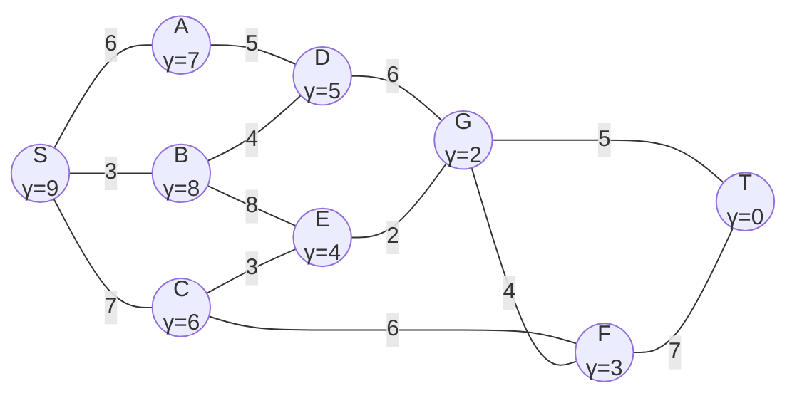
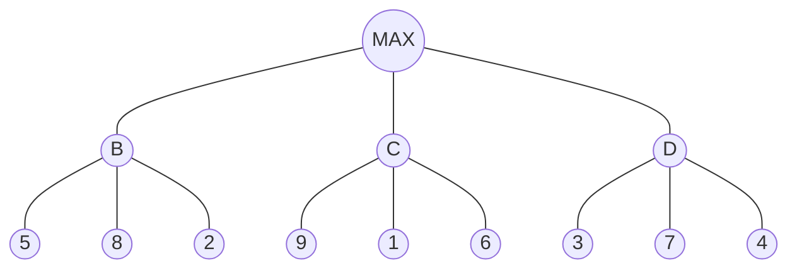
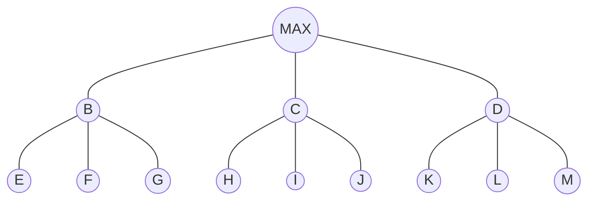

# UNIVERSIDADE FEDERAL DA GRANDE DOURADOS
## BACHARELADO EM SISTEMAS DE INFORMAÇÃO
### DISCIPLINA: INTELIGÊNCIA ARTIFICIAL
### PROFESSOR: ALEXANDRE AUGUSTO ANGELO DE SOUZA

# LISTA DE EXERCÍCIOS - 1ª AVALIAÇÃO

> **Nota de conversão:** Este documento é uma transcrição fiel e completa, em Markdown, do arquivo original `IA_-_Lista_de_exercicios_-_P1_-_SI.pdf` (6 páginas), preservando a ordem, a numeração das questões e todo o conteúdo textual e matemático. Fórmulas e símbolos matemáticos foram convertidos para notação LaTeX. Os diagramas e figuras do documento original (grafos, árvores de jogo, grids, tabuleiros) foram **recriados integralmente em notação Markdown/Mermaid/tabelas**, reproduzindo com exatidão os valores, rótulos e estrutura visual observados no PDF original — não foi necessário extrair imagens rasterizadas separadas, pois todos os elementos visuais do documento são diagramas estruturados (grafos, árvores, tabelas/grids) plenamente representáveis em texto/Markdown sem perda de informação. As tabelas que no original estavam em branco, para o aluno preencher, foram preservadas em branco.

---

## Parte I – Agentes Inteligentes

**1.** Defina, com suas próprias palavras, o que é um agente inteligente. Em sua definição, explique o papel dos sensores e dos atuadores e dê um exemplo de cada um deles para (a) um agente humano e (b) um agente robótico.

**2.** Explique a diferença entre função de agente e programa de agente. Por que, para a maioria dos agentes, não é viável implementar a função de agente como uma tabela completa de percepções para ações?

**3.** O que é a sigla PEAS e o que cada uma de suas letras representa? Elabore uma descrição PEAS completa para um agente robô aspirador de pó doméstico, preenchendo a tabela abaixo.

| Medida de desempenho | Ambiente | Atuadores | Sensores |
|---|---|---|---|
| | | | |

**4.** Para cada uma das propriedades de ambiente listadas a seguir, explique o que caracteriza os dois extremos indicados e dê um exemplo de ambiente real para cada extremo:

- observável: completo $\leftrightarrow$ parcial;
- determinístico: determinístico $\leftrightarrow$ estocástico;
- dinâmico: estático $\leftrightarrow$ dinâmico;
- conhecimento: conhecido $\leftrightarrow$ desconhecido.

**5.** Considere o **mundo do aspirador** com apenas dois locais, $A$ e $B$, em que cada local pode estar limpo ou sujo.

**(a)** Quantos estados possíveis existem nesse ambiente? Justifique numericamente.

**(b)** Escreva o vetor de estado na forma $[\text{posição do aspirador}, \text{estado de } A, \text{estado de } B]$ para o estado em que o aspirador está em $B$, a sala $A$ está suja e a sala $B$ está limpa.

**(c)** Considerando a regra simples "se a sala atual estiver suja, aspirar; caso contrário, mover-se para a outra sala", preencha a tabela de comportamento abaixo para as quatro percepções possíveis.

| Percepção $[\text{local}, \text{estado}]$ | Ação |
|---|---|
| $[A, \text{Suja}]$ | |
| $[A, \text{Limpa}]$ | |
| $[B, \text{Suja}]$ | |
| $[B, \text{Limpa}]$ | |

---

## Parte II – Busca em Espaço de Estados

**6.** Descreva os cinco elementos que compõem a "anatomia" de um problema de busca (estado inicial, ações, modelo de transição, teste de objetivo e custo de caminho), exemplificando cada um a partir do quebra-cabeça de 8 peças.

**7.** Ao representar um espaço de estados como um grafo, o que representam os vértices e o que representam as arestas? O que significa "solucionar" o problema nesse contexto?

**8.** Considere o estado inicial abaixo do quebra-cabeça de 8 peças, com o espaço em branco na posição superior esquerda. Desenhe o primeiro nível da árvore de busca gerado a partir desse estado, aplicando todos os operadores possíveis (mover o espaço em branco para cima, para baixo, para a esquerda e para a direita, quando aplicável).

Em seguida, calcule a heurística $h(n)$, definida como a soma das diferenças absolutas posição a posição, para cada um dos estados filhos gerados, comparando-os com o estado objetivo indicado, e indique qual filho o algoritmo A* priorizaria.

**Estado inicial:**

| | | |
|:---:|:---:|:---:|
| *(vazio)* | 2 | 6 |
| 1 | 4 | 8 |
| 7 | 5 | 3 |

**Estado objetivo:**

| | | |
|:---:|:---:|:---:|
| 1 | 2 | 3 |
| 4 | 5 | 6 |
| 7 | 8 | *(vazio)* |

---

## Parte III – Busca Heurística A*

**9.** O que é uma função heurística em um algoritmo de busca? O que significa dizer que uma heurística é **admissível**? Por que essa propriedade é importante para a otimalidade do A*?

**10.** Escreva a fórmula utilizada pelo algoritmo A* para calcular a prioridade $\alpha(v)$ de um vértice $v$, explicando o significado de cada um dos termos $\lambda(v)$ e $\gamma(v)$.

**11.** Calcule a distância Euclidiana entre os pontos $A(2,5)$ e $B(6,8)$. Mostre o cálculo.

**12.** Calcule a distância de Manhattan entre os pontos $A(3,2)$ e $B(9,7)$. Mostre o cálculo.

**13.** Compare as distâncias Euclidiana e Manhattan quanto ao tipo de deslocamento que cada uma representa e cite uma situação prática em que cada uma seria mais adequada como heurística.

**14.** Considere o grafo abaixo, em que os números ao lado de cada vértice indicam o valor da heurística $\gamma(v)$ (estimativa de distância até o destino $T$) e os números sobre as arestas indicam o custo de deslocamento entre os vértices. Execute o algoritmo A* para obter o caminho de custo mínimo do vértice $S$ até o vértice $T$.

> **Observação do Claude sobre a recriação do grafo:** o diagrama a seguir foi recriado em notação Mermaid a partir da inspeção visual cuidadosa do PDF original, preservando exatamente os vértices, os pesos das arestas e os valores de $\gamma(v)$ de cada vértice, tal como aparecem na página 3 do documento original.

**Lista de arestas (vértice — vértice : custo) para referência:**

| Aresta | Custo |
|---|:---:|
| $S-A$ | 6 |
| $S-B$ | 3 |
| $S-C$ | 7 |
| $A-D$ | 5 |
| $B-D$ | 4 |
| $B-E$ | 8 |
| $C-E$ | 3 |
| $C-F$ | 6 |
| $D-G$ | 6 |
| $E-G$ | 2 |
| $G-F$ | 4 |
| $G-T$ | 5 |
| $F-T$ | 7 |

**Valores de $\gamma(v)$ (heurística) por vértice:**

| $v$ | $S$ | $A$ | $B$ | $C$ | $D$ | $E$ | $F$ | $G$ | $T$ |
|---|:---:|:---:|:---:|:---:|:---:|:---:|:---:|:---:|:---:|
| $\gamma(v)$ | 9 | 7 | 8 | 6 | 5 | 4 | 3 | 2 | 0 |

Para resolver o exercício, preencha as duas tabelas a seguir a cada iteração do algoritmo.

**Tabela 1 – Fila de prioridades** (valores de $\alpha^{(k)}(v) = \lambda(v) + \gamma(v)$ a cada iteração $k$; utilize $\infty$ para os vértices ainda não alcançados):

| | $S$ | $A$ | $B$ | $C$ | $D$ | $E$ | $F$ | $G$ | $T$ |
|---|:---:|:---:|:---:|:---:|:---:|:---:|:---:|:---:|:---:|
| $\alpha^{(0)}(v)$ | 0 | | | | | | | | |
| $\alpha^{(1)}(v)$ | | | | | | | | | |
| $\alpha^{(2)}(v)$ | | | | | | | | | |
| $\alpha^{(3)}(v)$ | | | | | | | | | |
| $\alpha^{(4)}(v)$ | | | | | | | | | |
| $\alpha^{(5)}(v)$ | | | | | | | | | |

**Tabela 2 – Ordem de acesso aos vértices** (a cada vértice $u$ retirado da fila, indique os vizinhos ainda na fila $V' = \{v \in N(u) \land v \in Q\}$, o custo atualizado $\lambda(v)$ e o predecessor $\pi(v)$):

| $u$ | $V' = \{v \in N(u) \land v \in Q\}$ | $\lambda(v), \ \forall v \in V'$ | $\pi(v)$ |
|---|---|---|---|
| | | | |
| | | | |
| | | | |
| | | | |
| | | | |
| | | | |

Ao final, indique o caminho de custo mínimo encontrado de $S$ até $T$ e o seu custo total.

**15.** Em um *grid* $9 \times 6$, relativo ao problema do astronauta, a célula $C(3,4)$ possui um custo acumulado $G = 2$ a partir da origem $(1,4)$. Sabendo que o destino é a célula $(8,4)$ e utilizando a heurística de distância Euclidiana, calcule o valor de

$$F = G + H$$

para essa célula, mostrando os cálculos.

> **Observação do Claude sobre a recriação do grid:** a grade a seguir foi recriada como uma tabela Markdown, reproduzindo a posição exata de $A$ (posição inicial), $C$ (célula em análise, destacada) e $N$ (posição da nave/destino), bem como a área de obstáculo (campo de asteroides), tal como representados visualmente no PDF original (página 4). As linhas estão numeradas de 6 (topo) a 1 (base) e as colunas de 1 a 9, exatamente como no eixo do diagrama original.

| Linha \ Coluna | 1 | 2 | 3 | 4 | 5 | 6 | 7 | 8 | 9 |
|---|:---:|:---:|:---:|:---:|:---:|:---:|:---:|:---:|:---:|
| **6** | · | · | · | · | · | · | · | · | · |
| **5** | · | · | · | · | · | · | · | · | · |
| **4** | **A** | · | **C** | · | · | ▓ | ▓ | **N** | · |
| **3** | · | · | · | · | · | ▓ | ▓ | · | · |
| **2** | · | · | · | · | · | · | · | · | · |
| **1** | · | · | · | · | · | · | · | · | · |

**Legenda:**
- $A$ = posição inicial do astronauta $(1,4)$
- $N$ = posição da nave, destino $(8,4)$
- área cinza (▓) = campo de asteroides (obstáculo, intransponível)
- $C$ = célula $(3,4)$, objeto do cálculo

---

## Parte IV – Problema das $n$ Rainhas: Backtracking

> *Observação: embora o problema clássico seja apresentado para um tabuleiro $8 \times 8$, todas as questões desta parte utilizam a versão simplificada com quatro rainhas em um tabuleiro $4 \times 4$. As variáveis $x_1$, $x_2$, $x_3$ e $x_4$ indicam a coluna escolhida para a rainha das linhas 1, 2, 3 e 4, respectivamente.*

**16.** O que é a técnica de *backtracking*? Explique, com suas próprias palavras, o que significa "retroceder" quando uma tentativa leva a um conflito, e por que essa técnica evita explorar o espaço de busca por completo.

**17.** No problema das $n$ rainhas, como o estado é representado pela variável $x_i$? Em quais duas situações duas rainhas $i$ e $j$ se atacam mutuamente?

**18.** Para o problema das 4 rainhas, considere que a rainha da linha 1 é fixada na coluna 4, isto é, $x_1 = 4$. Desenhe a árvore de busca por *backtracking* completa a partir dessa decisão, indicando em cada nível qual linha e coluna estão sendo testadas e marcando com um X os ramos que terminam em conflito. O que se pode concluir sobre esse ramo da árvore? (Compare com o resultado obtido quando $x_1 = 1$.)

**Tabuleiro $4 \times 4$:**

| | 1 | 2 | 3 | 4 |
|---|:---:|:---:|:---:|:---:|
| **1** | | | | |
| **2** | | | | |
| **3** | | | | |
| **4** | | | | |

**19.** Repita o exercício anterior considerando agora que a rainha da linha 1 é fixada na coluna 3, isto é, $x_1 = 3$. Desenhe a árvore de busca até encontrar a primeira solução válida, indicando claramente a solução final na forma $(x_1, x_2, x_3, x_4)$.

**20.** Quantas soluções distintas existem para o problema das 4 rainhas? Escreva todas elas na notação $(x_1, x_2, x_3, x_4)$ e explique a relação de simetria (espelhamento) que existe entre as soluções obtidas a partir de $x_1 = 1$ e $x_1 = 4$, e entre as obtidas a partir de $x_1 = 2$ e $x_1 = 3$.

**21.** Explique por que, no problema das $n$ rainhas, a busca por *backtracking* não corre o risco de ficar presa em um "espaço infinito", ao contrário do que pode ocorrer em outros problemas de busca em profundidade.

---

## Parte V – Busca Competitiva: Minimax e Poda Alfa-Beta

**22.** O que caracteriza um "jogo de soma zero"? Quais valores de utilidade são tipicamente atribuídos à vitória, à derrota e ao empate?

**23.** Descreva os seis elementos que compõem o modelo formal de um jogo em busca competitiva:

- $S_0$;
- $\text{JOGADOR}(s)$;
- $\text{AÇÕES}(s)$;
- $\text{RESULTADO}(s, a)$;
- $\text{TERMINAL}(s)$;
- $\text{UTILIDADE}(s, p)$.

**24.** Considere a árvore de jogo abaixo, com raiz MAX e três filhos diretos, representados pelos nós MIN $B$, $C$ e $D$, cada um com três folhas. Aplique o algoritmo Minimax por indução regressiva, das folhas até a raiz, determine o valor final de cada nó ($B$, $C$, $D$ e da raiz) e indique qual seria a jogada escolhida pelo jogador MAX.

> **Observação do Claude sobre a recriação da árvore:** recriada em Mermaid, reproduzindo fielmente a estrutura (raiz MAX, nível intermediário MIN com nós $B$, $C$, $D$, e as folhas de cada um) e os valores numéricos das folhas, conforme a página 5 do PDF original.

*(Nível MIN: nós $B$, $C$, $D$. Folhas de $B$: 5, 8, 2. Folhas de $C$: 9, 1, 6. Folhas de $D$: 3, 7, 4.)*

**25.** Refaça o exercício anterior aplicando a poda Alfa-Beta à árvore abaixo (estrutura análoga, com os nós renomeados). Percorra os nós da esquerda para a direita, anotando os valores de $\alpha$ e $\beta$ a cada passo e indicando com um X quais folhas podem ser podadas (isto é, não precisam ser avaliadas) e por quê.

> **Observação do Claude sobre a recriação da árvore:** recriada em Mermaid a partir da página 6 do PDF original, preservando a estrutura (raiz MAX, nível MIN com nós $B$, $C$, $D$, e nível de folhas com nós $E$ a $M$) e os valores numéricos de cada folha.

**Valores das folhas:**

| Folha | $E$ | $F$ | $G$ | $H$ | $I$ | $J$ | $K$ | $L$ | $M$ |
|---|:---:|:---:|:---:|:---:|:---:|:---:|:---:|:---:|:---:|
| Valor | 4 | 9 | 6 | 2 | 5 | 1 | 8 | 3 | 10 |

*(Nível MIN: nós $B$ (filhos $E$, $F$, $G$), $C$ (filhos $H$, $I$, $J$), $D$ (filhos $K$, $L$, $M$).)*

**26.** Qual é a condição de poda utilizada no algoritmo Minimax com poda Alfa-Beta, considerando a relação entre $\alpha$ e $\beta$? Explique, com suas próprias palavras, o que essa condição significa em termos de "não vale a pena continuar explorando esse ramo".

**27.** O fator médio de ramificação do xadrez é próximo de 35. Explique por que esse valor torna inviável uma busca Minimax completa até o final do jogo e qual é o papel da poda Alfa-Beta e das funções de avaliação heurística nesse contexto.

---

> **Fim da Lista de Exercícios.** Documento fonte: `IA_-_Lista_de_exercicios_-_P1_-_SI.pdf` (Universidade Federal da Grande Dourados — Bacharelado em Sistemas de Informação — Disciplina: Inteligência Artificial — Prof. Alexandre Augusto Angelo de Souza). Transcrição e formatação em Markdown realizadas preservando integralmente o conteúdo original, sem resumos ou omissões.
